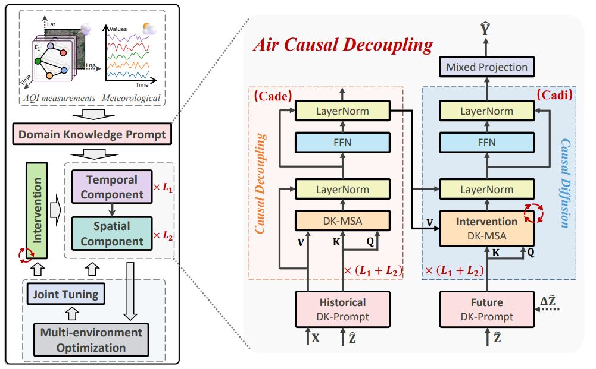

# Spatiotemporal Causal Decoupling Model for Air  Quality Forecasting(ICASSP 2025)
This is the official repository of our ICASSP 2025 paper. The proposed model, AirCade, addresses the limitations of current air quality forecasting models by integrating prior knowledge and current meteorological conditions into its architecture. It comprises a causal decoupling module designed to isolate the influence of prior knowledge on air quality index (AQI) data, and an environment simulation module that simulates the impact of future meteorological data on AQI. To account for the uncertainty of future meteorological conditions, AirCade implements perturbations and incorporates variance regularization and maximization in its optimization process. The model is evaluated on the largest available open-source PM2.5 dataset, demonstrating effective performance.

<br>



<br>

## 1. Introduction about the datasets
### 1.1 Generating num 1 and num 2 sub-datasets from Knowair
In the experiments of our paper, we used num 1 and num 2 datasets with years from 2015 and 2017 respectively, which were followed by [Knowair](https://github.com/shuowang-ai/PM2.5-GNN). For example, you can download Knowair dataset from the provided [link](https://drive.google.com/file/d/1R6hS5VAgjJQ_wu8i5qoLjIxY0BG7RD1L/view) and please place the downloaded `Knowair.npy` file in the `AirCade_ICASSP` folder and complete the files in the `AirCade_ICASSP/data` folder.
  
```
python experiments/AirCade/train.py --device cuda:1 --num 1
```
Moreover, you can also generate the other years of data as the additional subdatasets. 

<br>

## 2. Environmental Requirments
The experiment requires the same environment as [Knowair](https://github.com/shuowang-ai/PM2.5-GNN).

<br>

## 3. Model Running
To run AirCade on <b>Knowair</b>, for example, you may execute this command in the terminal:
```
bash run.sh
```
or directly execute the Python file in the terminal:
```
python experiments/AirCade/train.py --device cuda:1 --num 1
```
